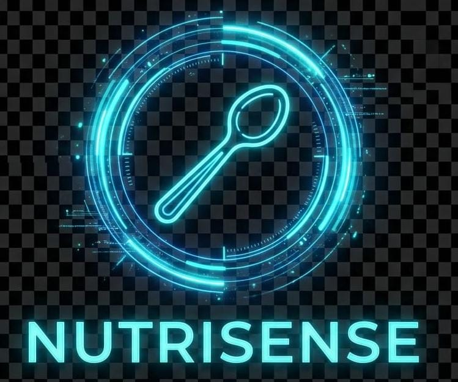
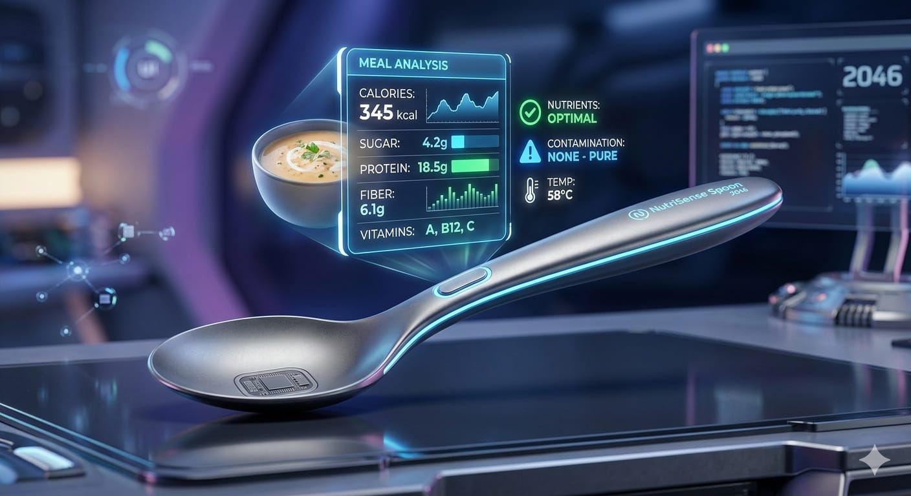

<div align="center">

# 🥄 NutriSense Spoon

### AI-Powered Food Intelligence Platform

**Understand your food. Understand your nutrition.**



<br>

[]()
[]()
[]()
[]()
[]()

<br>

**[🌐 Live Prototype](https://nutrisense-spoon.lovable.app)** ·
**[💻 GitHub Repository](https://github.com/Abiya-Daniel/nutrisense-spoon-web)**

</div>

---

## 📌 Overview

**NutriSense Spoon** is an early-stage **AI-powered food intelligence platform** designed to simplify the way people understand their meals and nutrition.

Instead of relying entirely on manual food logging, NutriSense Spoon explores an intelligent workflow that can understand a real meal, estimate its nutritional composition, and provide personalized insights.

> **From what you eat → to what it means for you.**

The initial product direction is **India-first**, focusing on the complexity of homemade meals, regional cuisines, mixed dishes, and diverse preparation methods.

---

## 🚨 The Problem

Most nutrition tracking systems depend on users manually:

* Searching for food items
* Selecting database entries
* Estimating portions
* Entering quantities
* Logging every meal

This becomes difficult when dealing with:

**Homemade food · Mixed dishes · Regional cuisines · Unstandardized portions · Recipe variations**

For example, understanding a Kerala-style meal is not simply identifying *rice, avial, sambar, thoran, fish curry,* and *curd*.

The system needs to understand:

```text
Food → Ingredients → Preparation → Portion → Nutrition → Context
```

### The Core Problem

> **People eat real meals. Most nutrition systems expect structured database entries.**

---

## 💡 The Solution

NutriSense Spoon aims to create an intelligent layer between **food and nutrition understanding**.

```text
        📸 MEAL
           │
           ▼
   ┌───────────────┐
   │ Food Analysis │
   └───────┬───────┘
           │
     ┌─────┼─────┐
     ▼     ▼     ▼
    Food Portion Context
    ID     Est.   Analysis
     │     │     │
     └─────┼─────┘
           ▼
   ┌───────────────┐
   │   Nutrition   │
   │    Engine     │
   └───────┬───────┘
           │
           ▼
   ┌───────────────┐
   │ Personalization│
   └───────┬───────┘
           │
           ▼
   💡 Actionable Insight
```

The goal is to move from:

**Manual Tracking → Intelligent Food Understanding**

---

## 🧠 Product Intelligence

NutriSense Spoon is built around five intelligence layers:

| Layer                         | Purpose                                                   |
| ----------------------------- | --------------------------------------------------------- |
| 🍽️ **Food Understanding**    | Identify foods, ingredients, dishes, and meal composition |
| 🥄 **Portion Intelligence**   | Estimate approximate serving quantities                   |
| 📊 **Nutrition Intelligence** | Translate food and portions into nutritional information  |
| 👤 **Personal Intelligence**  | Consider goals, preferences, and eating patterns          |
| 💡 **Action Intelligence**    | Convert nutrition data into understandable insights       |

---

## ✨ Key Features

### 📸 AI Meal Understanding

Analyze real-world meals and identify food components.

### 🥄 Portion Intelligence

Estimate approximate portions while communicating uncertainty.

### 📊 Nutrition Analysis

Provide nutritional estimates such as:

* Calories
* Protein
* Carbohydrates
* Fat
* Fiber
* Selected micronutrients

### 👤 Personalized Nutrition

Adapt insights according to individual goals and preferences.

### 📈 Nutrition Trends

Track and understand nutrition patterns over time.

### 🍽️ Intelligent Meal Planning

Future capability for personalized meal recommendations.

### 🛒 Grocery Intelligence

Future capability connecting nutrition goals with grocery planning.

### 🧑‍⚕️ Professional Tools

Future tools for nutritionists, dietitians, fitness professionals, and wellness coaches.

### 🔌 Food Intelligence API

Long-term platform capability for integrating food intelligence into external applications.

---

## 🇮🇳 India-First Approach

India is the initial focus because of its highly diverse food ecosystem.

Food can vary by:

* Region
* Culture
* Household
* Ingredients
* Cooking method
* Recipe
* Portion size

### Strategic Wedge

> **AI-powered understanding of complex Indian meals.**

The long-term vision is to expand from Indian food intelligence toward **global food intelligence**.

---

## ⭐ What Makes NutriSense Spoon Different?

| Traditional Nutrition Apps | NutriSense Spoon         |
| -------------------------- | ------------------------ |
| Manual food entry          | Intelligent meal capture |
| Individual food records    | Whole-meal understanding |
| Standardized database      | Real-world food context  |
| Nutrition numbers          | Nutrition intelligence   |
| Generic information        | Personalized insights    |
| Tracking-focused           | Understanding-focused    |
| Global-first               | India-first              |

### Product Thesis

> **We are not building another food diary.**
>
> **We are building toward a system that understands food.**

---

## 🏗️ Architecture

The long-term product architecture is envisioned as:

```text
┌──────────────────────┐
│      MEAL INPUT      │
└──────────┬───────────┘
           ↓
┌──────────────────────┐
│ FOOD UNDERSTANDING   │
└──────────┬───────────┘
           ↓
┌─────────────────────────────┐
│ Food · Ingredients · Recipe │
│ Preparation · Cuisine       │
└──────────┬──────────────────┘
           ↓
┌──────────────────────┐
│ PORTION INTELLIGENCE │
└──────────┬───────────┘
           ↓
┌──────────────────────┐
│  NUTRITION ENGINE    │
└──────────┬───────────┘
           ↓
┌──────────────────────┐
│   PERSONALIZATION    │
└──────────┬───────────┘
           ↓
┌──────────────────────┐
│ ACTIONABLE INSIGHT   │
└──────────────────────┘
```

---

## 🚀 Product Roadmap

```text
Phase 1
Foundation
   ↓
Phase 2
Food Intelligence
   ↓
Phase 3
Personal Intelligence
   ↓
Phase 4
Ecosystem
   ↓
Phase 5
Food Intelligence Platform
```

### Phase 1 — Foundation

* Responsive web application
* Nutrition-focused UI
* Core product flows
* Prototype validation

### Phase 2 — Food Intelligence

* Meal image analysis
* Food recognition
* Indian food dataset
* Ingredient understanding
* Portion estimation
* Nutrition estimation

### Phase 3 — Personal Intelligence

* User profiles
* Meal history
* Nutrition trends
* Personalized insights
* Meal recommendations

### Phase 4 — Ecosystem

* Nutritionist dashboard
* Fitness integrations
* Restaurant integrations
* Institutional applications
* Wellness partnerships

### Phase 5 — Platform

* Food Intelligence API
* Enterprise integrations
* Global cuisine intelligence
* Food knowledge graph
* Developer ecosystem

---

## 🧪 Current Status

### 🟡 Early Prototype

The current repository focuses on the **frontend experience and product foundation**.

### Currently Available

* Responsive web interface
* Nutrition-focused experience
* Interactive UI
* Modern component architecture
* Desktop and mobile layouts

### Under Development / Planned

* AI meal understanding
* Food recognition
* Portion intelligence
* Indian food intelligence
* Nutrition estimation
* Personalization
* Recommendation systems
* Professional tools
* B2B integrations

> **Note:** Planned features are part of the product roadmap and are not necessarily implemented in the current prototype.

---

## 📸 Product Preview

<div align="center">



</div>

---

## 🛠️ Tech Stack

| Technology       | Role                              |
| ---------------- | --------------------------------- |
| **React**        | Frontend framework                |
| **TypeScript**   | Type-safe development             |
| **Vite**         | Build tool and development server |
| **Tailwind CSS** | Styling and responsive UI         |
| **Node.js**      | Runtime environment               |
| **npm**          | Package management                |
| **Git & GitHub** | Version control                   |

### Future Intelligence Stack

The platform may evolve using:

**Computer Vision · Multimodal AI · Machine Learning · Nutrition Databases · Knowledge Graphs · Recommendation Systems · Cloud APIs**

---

## 📂 Project Structure

```text
nutrisense-spoon-web/
│
├── public/
├── src/
├── web/
│   ├── logo.png
│   └── spoon.png
│
├── index.html
├── package.json
├── package-lock.json
├── vite.config.ts
├── tailwind.config.ts
├── tsconfig.json
├── postcss.config.js
├── eslint.config.js
├── .gitignore
└── README.md
```

---

## 🚀 Getting Started

### Prerequisites

* Node.js
* npm
* Git

### Clone

```bash
git clone https://github.com/Abiya-Daniel/nutrisense-spoon-web.git
cd nutrisense-spoon-web
```

### Install Dependencies

```bash
npm install
```

### Run Development Server

```bash
npm run dev
```

Open:

```text
http://localhost:5173
```

### Build for Production

```bash
npm run build
```

### Preview Production Build

```bash
npm run preview
```

---

## 💰 Future Business Model

NutriSense Spoon has the potential to evolve across multiple revenue layers:

```text
B2C Freemium
      ↓
Premium Subscription
      ↓
Professional SaaS
      ↓
B2B Integrations
      ↓
Food Intelligence API
```

Potential customers include:

**Consumers · Nutrition Professionals · Fitness Platforms · Wellness Companies · Food Businesses · Institutions · Corporate Wellness**

---

## 🛡️ Responsible AI & Privacy

Nutrition information can influence personal health decisions. NutriSense Spoon is therefore designed around responsible technology principles:

* Transparent estimates
* Confidence-aware results
* Clear distinction between estimates and measurements
* Privacy-conscious data handling
* User control over personal information
* Minimal unnecessary data collection
* Professional oversight where appropriate

> NutriSense Spoon is intended to support nutrition awareness and informed decision-making, not replace qualified healthcare or nutrition professionals.

---

## 🔮 Long-Term Vision

The long-term ambition is to build a **Food Intelligence Layer** connecting food with context, nutrition, personalization, and action.

```text
                       FOOD
                         ↓
                FOOD INTELLIGENCE
                         ↓
          ┌──────────────┼──────────────┐
          ↓              ↓              ↓
      NUTRITION       CONTEXT        PATTERNS
          └──────────────┼──────────────┘
                         ↓
                  PERSONALIZATION
                         ↓
                ACTIONABLE INSIGHT
                         ↓
                  BETTER DECISIONS
```

Ultimately:

> **NutriSense Spoon aims to make food understandable.**

---

## 👨‍💻 Founder

**Abiya Daniel**
Computer Science & Engineering
College of Engineering Perumon, Kerala, India

---

## 📄 Disclaimer

NutriSense Spoon is currently an **early-stage prototype**. Features described as planned or future capabilities may not be available in the current version.

Any future nutritional estimates should be considered informational estimates and not medical advice, diagnosis, or a replacement for qualified professional guidance.

---

<div align="center">

# 🥄 NutriSense Spoon

### **Understand your food. Understand your nutrition.**

**From what you eat → to what it means for you.**

⭐ *Building toward intelligent food understanding, one meal at a time.*

</div>
